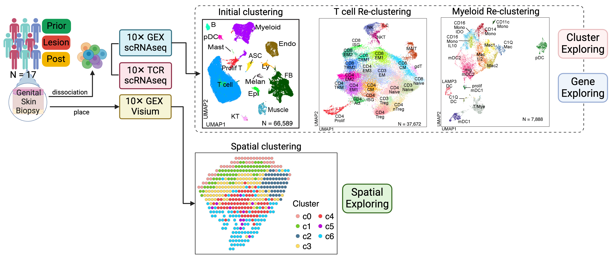

<h1 align="center">

HSV Genital Skin Biopsy scRNAseq Explorer

</h1>

[<strong>By:</strong> Joe Hou]{style="font-size:20px;"}

## [Overview]{style="font-size: 26px;text-decoration: underline;"}

This Shiny application provides an interactive interface for exploring
10X scRNAseq data derived from HSV+ skin biopsy samples.
[**https://hsvdashboard.joehou.net/**](https://hsvdashboard.joehou.net/){.uri}.\
As the manuscript is currently under review for publication, the raw and
processed data remain undisclosed.

[- **About the cohort:**]{style="font-size: 20px;"}

This study involved healthy adults with confirmed herpes simplex virus
type 2 (HSV-2) seropositivity, verified via Western blot analysis. All
participants tested negative for HIV. In this longitudinal HSV study, we
enrolled 17 participants and collected genital skin biopsies at three
distinct time points to capture HSV shedding and healing phases.

[- **About the time points:**]{style="font-size: 20px;"}

Samples were collected at three key stages: the first, labeled "Prior,"
was collected before any visible lesions appeared. When lesions became
visible, samples were labeled as "Lesion." Finally, samples taken 8
weeks after lesion appearance are referred to as "Post."

[- **About the dataset:**]{style="font-size: 20px;"}

This release includes datasets with refined mapping for T cells, Myeloid
cells and Visium data. Users can freely select from the available
datasets for exploration. We recommend using the "CellType_Level3"
annotation for visualization, as it provides the most detailed and
granular clustering. While "CellType_Level1" offers a broader
categorization, "CellType_Level3" represents the final, detailed
clustering, with cell types identified at a higher level of specificity.
Full definitions of each cell cluster and cell type will be provided in
the manuscript upon publication.

## [Features and Functionalities]{style="font-size: 26px;text-decoration: underline;"}

::: {style="font-size: 16px;"}
Two main tabs are provided for **scRNAseq** and **spatial Visium** data.

For **scRNAseq** data:

Two separate tabs are provided for data exploration, with a focus on:

(1) Cell Cluster Composition:

-   **Goal:** Analyze the composition of cell clusters across time
    points and individuals, with some clusters showing specificity to
    time points and variability across participants.

(2) Gene Expression Patterns:

-   **Goal:** Investigate gene expression patterns across different cell
    clusters, including gene distribution and expression variability
    across time points.

For **Visium** data:

(1) Gene Expression Patterns:

-   **Goal:** Investigate gene expression distribution and intensity
    across tissue.

(2) Cell Type De-convolution:

-   **Goal:** To further understand cell type composition per spatial
    location.
:::

### [Interactive Exploration on Cell Type (Cluster Discovery Tab)]{style="font-size: 20px;"}

::: {style="font-size: 16px;"}
-   **Cell Type and Status Identification:** Users can view all
    available cell types and subjects, with the flexibility to select
    specific ones for detailed exploration.
-   **Dynamic UMAP Visualization:** Initial displays show holistic UMAP
    results, which can be refined by time point. Selecting different
    subjects and cell types dynamically updates the UMAP to show
    specific clusters.
-   **Cell Type Statistics:** Displays percentages and counts of cell
    types for selected or all subjects.
-   **Cell Type by Subject:** Visualizes the percentage of each cell
    type within a given sample using stacked bar plots to understand the
    heterogeneity of cell type acroos samples
:::

### [Interactive Exploration on Gene Expression (Gene Discovery Tab)]{style="font-size: 20px;"}

::: {style="font-size: 16px;"}
-   **Feature Exploration:** Allows for the selection of cell types,
    subjects, and specific genes of interest.
-   **At Single Cell Level:**
-   **Feature Gene Highlight:** The expression of selected gene
    projected to UMAP overlay with cell type annotation, vividly display
    gene expression pattern across cell types.
-   **Heatmap:** Shows selected gene expression intensity per cell,
    grouped by cell types, statuses, and subject, aiding in providing
    gene details per sample.
-   **At Cell Type Level:**
-   **Violin Plots:** The selected gene expression was summarized into
    cell type level and shows average expression levels across cell
    types and statuses, aiding in understanding temporal dynamics.
-   **Feature Percentage Plots:** Summarizes gene expression at the
    sample/subject level, indicating the proportion of cells expressing
    a specific gene within a cell type.
-   **Dot Plots:** Dot size indicates the percentage of cells expressing
    each gene, while color intensity represents gene expression levels.
:::

## [Tech Note]{style="font-size: 26px;text-decoration: underline;"}

::: {style="font-size: 16px;"}
-   **HDF5 Array File System**: Utilized to prevent RAM overload by
    saving massive data in HDF5 files and processing them directly from
    disk. This approach enhances memory efficiency when handling large
    datasets.
-   **Docker Image**: The application is containerized using Docker to
    ensure consistency across different platforms. This allows for a
    reliable and reproducible environment for all users. You can run
    command line below to get this container runs locally: finch run -it
    --rm -p 7777:3838 jhoufred/hsv-dashboard-image:2.0 or this: docker
    run -d -p 7777:3838 jhoufred/hsv-dashboard-image:2.0
-   **AWS EC2 Backend**: The application is deployed on AWS EC2,
    providing a scalable and robust backend infrastructure for
    performance and reliability.
:::

## [Version2 Update]{style="font-size: 26px;text-decoration: underline;"}

::: {style="font-size: 16px;"}
-   **NEW AWS Architecture**: Elastic Container Registry (ECR), Elastic
    Container Service (ECS), Application Load Balancer (ALB), Auto
    Scaling, and Route 53
:::

## [Gallery]{style="font-size: 26px;text-decoration: underline;"}

Here are some visual showcases of the application features:

|  |  |
|------------------------------------|------------------------------------|
| {alt="Demo 1"} | {alt="Demo 3"} |
| {alt="Demo 5"} | {alt="Demo 7"} |

### [Version Release]{style="font-size: 20px;"}

Nov-1-2024: release ver 1.0
Mar-7-2025: release ver 2.0

